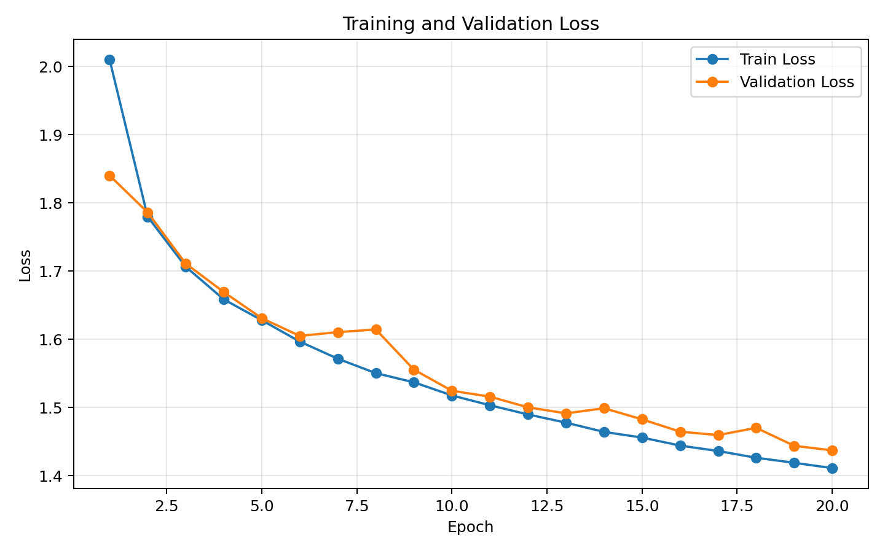
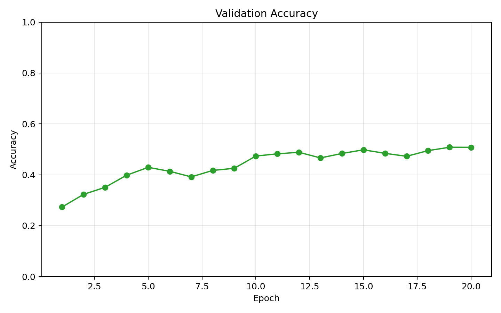
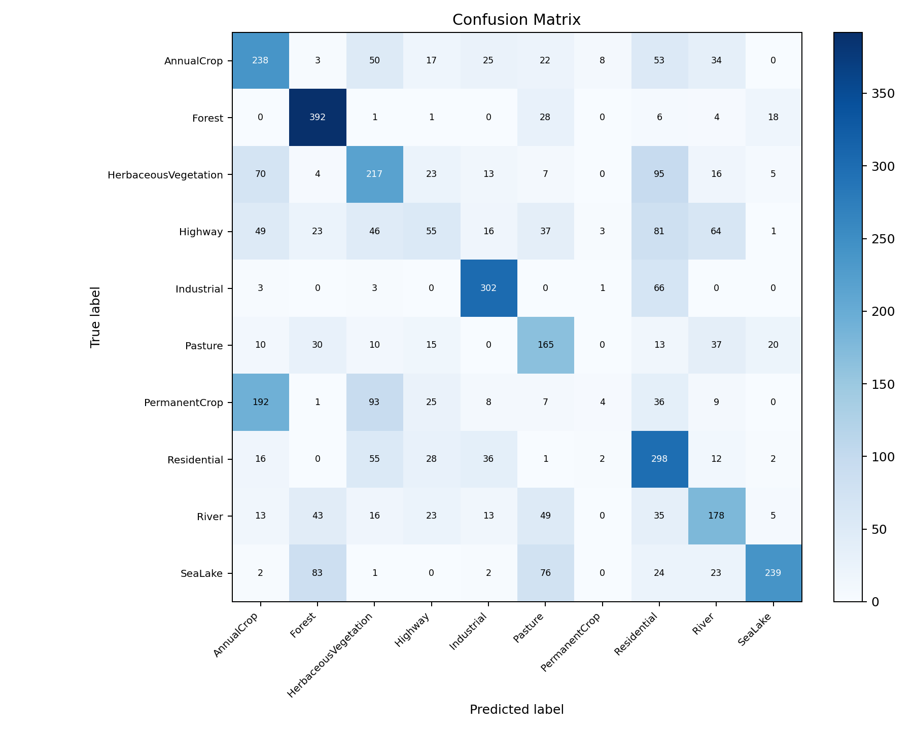
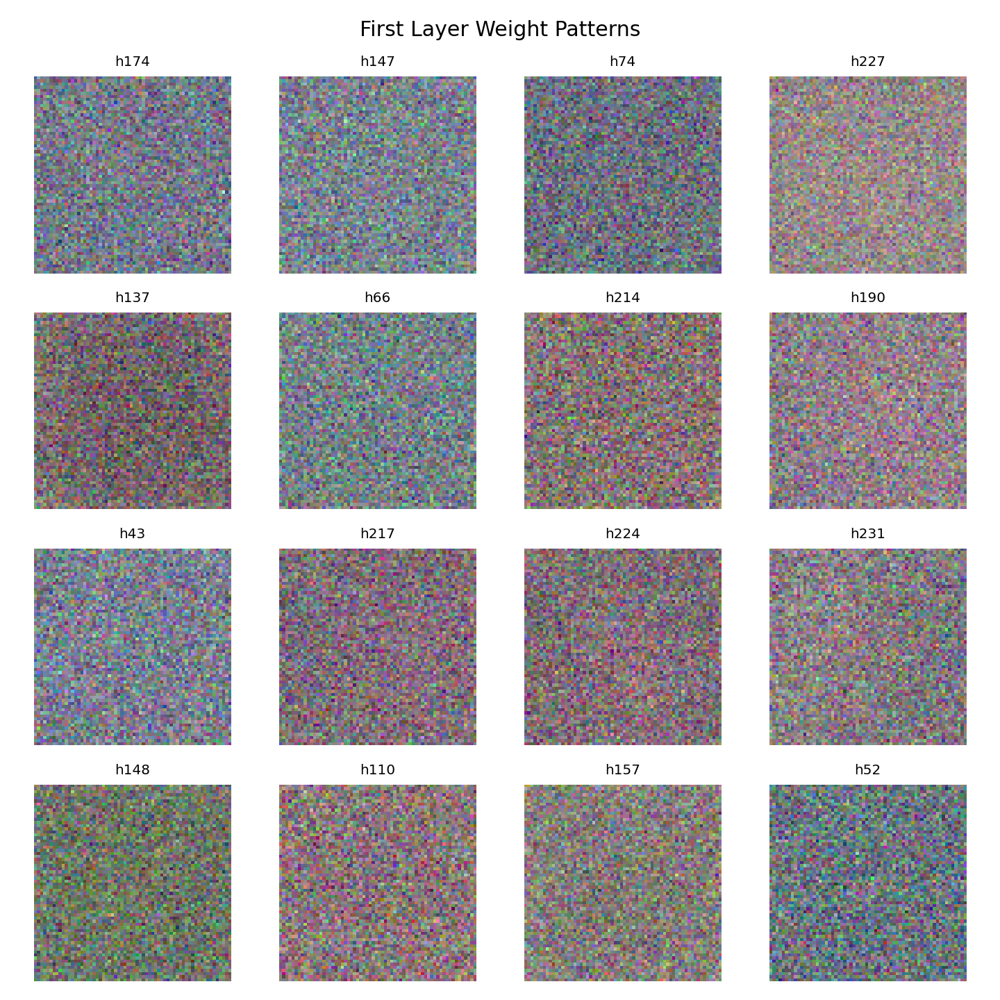
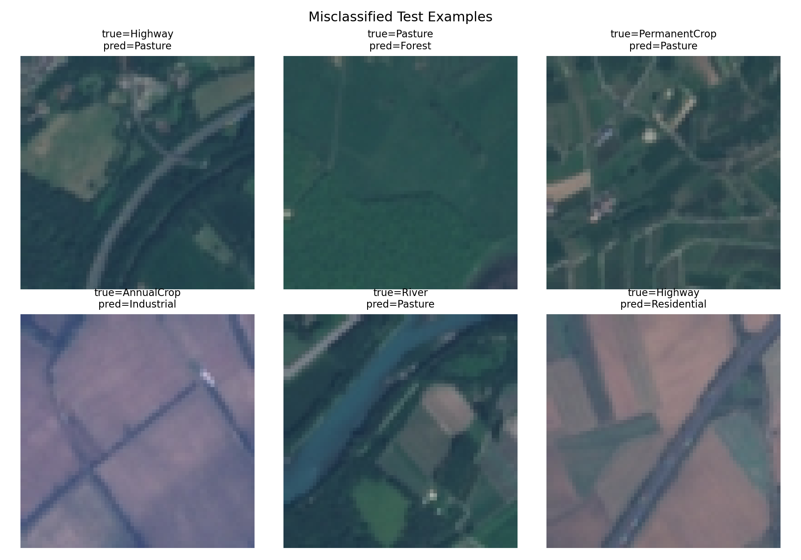

# HW1: 从零开始构建三层神经网络分类器实现地表覆盖图像分类

姓名：邓捷比

学号：25210980029

## 1. 任务简介

本作业使用 EuroSAT RGB 遥感图像数据集完成 10 类地表覆盖分类。模型为从零实现的三层多层感知机（MLP），不使用 PyTorch、TensorFlow、JAX 等自动微分框架。代码使用 NumPy 完成矩阵运算，并手写前向传播、反向传播、SGD 优化、学习率衰减、交叉熵损失和 L2 正则化。

Project name: `eurosat-mlp-from-scratch`

GitHub Repo: `请在提交前替换为 Public GitHub Repo 链接`

模型权重下载地址: `请在提交前替换为 Google Drive 或其他网盘链接`

## 2. 数据集与预处理

EuroSAT RGB 数据集包含 10 个类别：AnnualCrop、Forest、HerbaceousVegetation、Highway、Industrial、Pasture、PermanentCrop、Residential、River、SeaLake。每张图像为原始 `64x64 RGB` 格式。本实验不进行 resize，直接将图像展平成长度为 `64 * 64 * 3 = 12288` 的向量作为 MLP 输入。

预处理流程如下：

1. 读取每个类别目录下的 RGB 图像。
2. 保持原始 `64x64` 尺寸，不 resize。
3. 将像素值从 `[0, 255]` 归一化到 `[0, 1]`。
4. 按类别进行分层划分，比例为 `70% train / 15% validation / 15% test`。
5. 使用固定随机种子 `42` 保证实验可复现。

## 3. 模型结构与反向传播

模型为三层 MLP：

```text
Input(12288) -> Linear -> Activation -> Linear -> Activation -> Linear -> Logits(10)
```

隐藏层维度通过 `--hidden_dim` 指定，默认使用 `128`。激活函数支持 `ReLU` 和 `Tanh`，可通过 `--activation` 切换。

反向传播由代码手写实现。Linear 层缓存输入，在 backward 中计算 `dW`、`db` 和传回上一层的梯度；激活函数根据前向缓存计算局部梯度；softmax cross-entropy 使用数值稳定写法，先对 logits 减去每行最大值再计算概率。L2 正则化只作用于权重矩阵，不作用于 bias。

## 4. 训练设置

优化器使用 mini-batch SGD。每个 epoch 结束后学习率乘以衰减系数，默认 `lr_decay=0.95`。训练过程中记录训练集 loss、验证集 loss、验证集 accuracy 和当前学习率。代码根据验证集 accuracy 自动保存最佳模型权重。

最终训练使用的命令如下：

```powershell
conda run -n llm python src/train.py --data_dir EuroSAT_RGB --epochs 20 --batch_size 128 --lr 0.01 --hidden_dim 256 --weight_decay 0.0001 --activation tanh --output_dir outputs
```

最终模型配置为：`hidden_dim=256`，`activation=tanh`，`learning_rate=0.01`，`weight_decay=1e-4`，`batch_size=128`，`epochs=20`。最佳验证集结果出现在第 19 个 epoch，验证集 accuracy 为 `0.5081`。

## 5. 超参数搜索

本实验采用轻量网格搜索，搜索空间如下：

| Hyperparameter   | Values                         |
| ---------------- | ------------------------------ |
| learning rate    | `0.01`, `0.005`, `0.001` |
| hidden dimension | `128`, `256`               |
| weight decay     | `0.0`, `1e-4`              |
| activation       | `relu`, `tanh`             |

搜索结果保存于 `outputs/search_results.csv`。本次搜索每组训练 5 个 epoch，按验证集 accuracy 排名前三的结果如下：

| Rank | LR   | Hidden Dim | Weight Decay | Activation | Val Accuracy |
| ---- | ---- | ---------- | ------------ | ---------- | ------------ |
| 1    | 0.01 | 256        | 1e-4         | tanh       | 0.4291       |
| 2    | 0.01 | 256        | 0.0          | tanh       | 0.4289       |
| 3    | 0.01 | 128        | 0.0          | tanh       | 0.4212       |

从搜索结果看，`tanh` 在前 5 个 epoch 内整体优于 `relu`，较大的 hidden dimension 在该设置下也略有收益。因此最终训练选择 `lr=0.01, hidden_dim=256, weight_decay=1e-4, activation=tanh`。

## 6. 实验结果

最佳模型测试准确率：`0.5156`

测试命令如下：

```powershell
conda run -n llm python src/test.py --data_dir EuroSAT_RGB --checkpoint outputs/best_model.npz --output_dir outputs
```

训练和验证 loss 曲线如下：



验证集 accuracy 曲线如下：



测试集混淆矩阵如下：



## 7. 第一层权重可视化与空间模式观察

第一层权重矩阵 `W1` 的形状为 `(12288, hidden_dim)`。为了观察模型从输入图像中学习到的模式，本实验选择权重范数最大的 16 个隐藏神经元，将对应权重向量 reshape 回 `64x64x3` 并归一化显示。



从可视化结果可以观察第一层神经元是否对特定颜色通道或空间纹理更敏感。例如，部分权重呈现明显的颜色偏好，这可能对应森林、植被或水体区域的颜色特征；也有部分权重图呈现较粗糙的块状或线状响应，可能与道路、河流、住宅区等地物结构相关。不过，由于 MLP 将图像展平成向量，缺少卷积网络的局部平移共享机制，因此其空间模式通常不如 CNN 清晰，权重图也更像全局模板而不是局部纹理检测器。

## 8. 错例分析

测试集错例示例如下：



可能的错误原因包括：

1. Highway 与 River 都可能呈现细长线状结构，在低分辨率遥感图像中容易混淆。
2. AnnualCrop、PermanentCrop 和 HerbaceousVegetation 的颜色与纹理相近，MLP 难以稳定区分细粒度植被差异。
3. Industrial 与 Residential 都可能包含规则建筑块和道路，类别边界不明显。
4. Pasture 样本数量相对较少，模型可能对该类学习不足。
5. MLP 不显式建模局部空间邻域，同一类别在旋转、尺度、背景混杂情况下会更难被统一表示。

## 9. 总结

本实验完成了一个不依赖自动微分框架的三层 MLP 遥感图像分类器。实验实现了数据加载、手写反向传播、SGD、学习率衰减、交叉熵损失、L2 正则化、超参数搜索、最佳模型保存、测试集评估、混淆矩阵、第一层权重可视化和错例分析。由于 MLP 直接处理展平图像，无法显式利用局部空间结构，因此性能可能受限；后续可尝试 CNN 或数据增强进一步提升分类效果。
